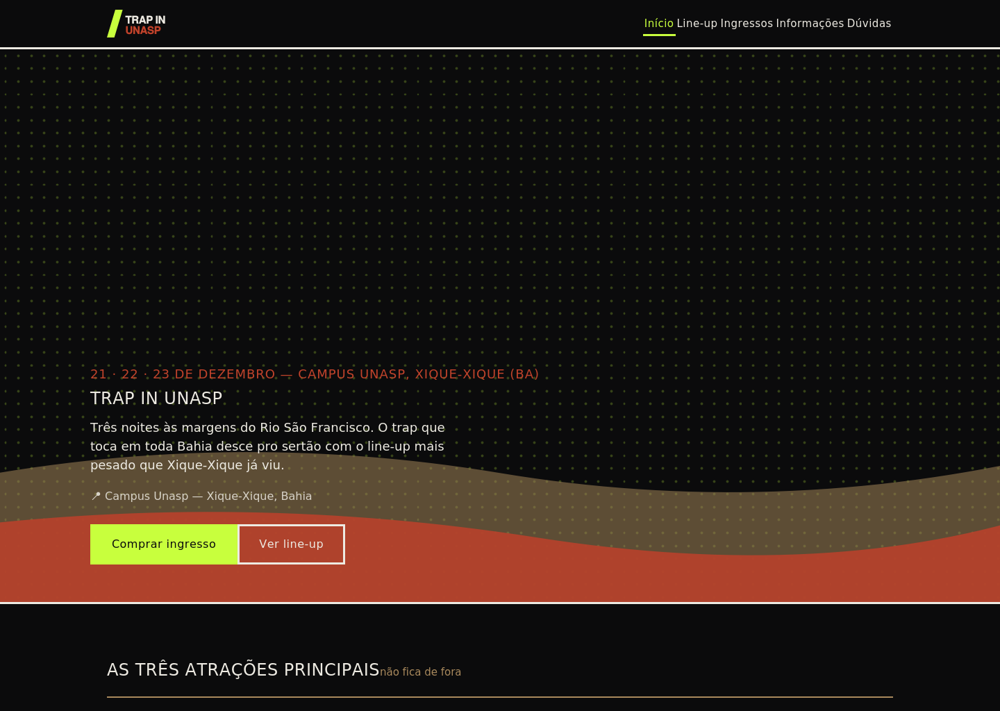
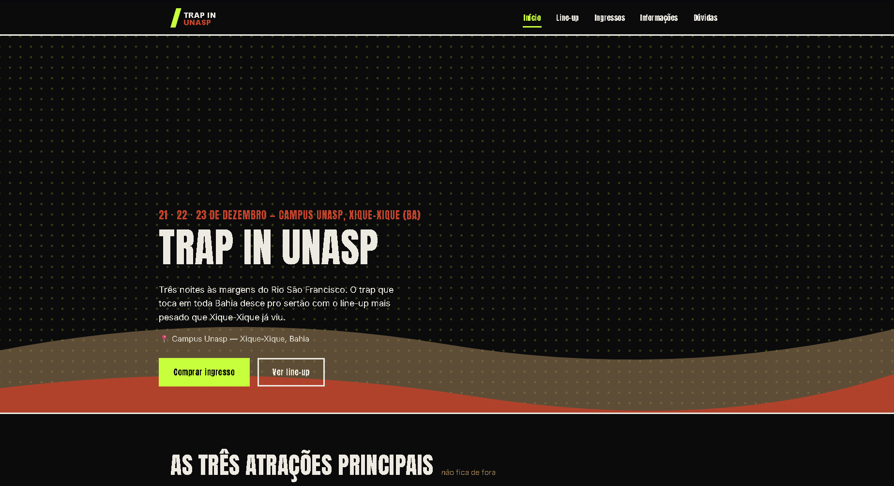

# Trap In Unasp

**Dupla:** Gustavo Martinez e Alexandre .A
**Site publicado:**
(https://marciu-ia-alexandre-a-e-gustavo-m.vercel.app)

## Briefing

**Público:** jovens de 16 a 28 anos, universitários e moradores de Xique-Xique e região, que curtem trap e rap nacional e querem um rolê de fim de ano diferente do forró e do sertanejo que dominam a cidade em dezembro. Esperam grave forte, artistas que já conhecem do streaming e um evento com identidade local — não uma cópia de festival de capital.

**Clima em 3 palavras:** árido, urbano, intenso.

**Paleta de cores:**
| Cor | Hex | Onde é usada |
|---|---|---|
| Preto | `#0B0B0C` | Fundo principal de todas as páginas |
| Verde-lima | `#C8FF3D` | Botões principais, links ativos do menu, detalhes de destaque |
| Terracota | `#C1432B` | Datas, rótulos de ingresso, acentos de headliner |
| Poeira (bege-terroso) | `#A9895C` | Bordas, divisórias, texto secundário — remete à terra do sertão |
| Papel (quase branco) | `#EDEAE2` | Texto principal sobre o fundo escuro |

**Fontes (Google Fonts):**
- **Anton** — títulos e destaques. Escolhida por ter peso e um corte quase de cartaz colado em poste, com cara de flyer de rua.
- **Inter** — textos corridos. Escolhida por ser bem legível em telas pequenas, já que boa parte do público vai acessar pelo celular.

**Sites de inspiração:**
1. [rollingloud.com](https://rollingloud.com) — gostamos do contraste alto e do jeito "cartaz" de anunciar os headliners, sem suavizar a estética urbana do trap.
2. [lollapalooza.com.br](https://lollapalooza.com.br) — inspirou a estrutura de páginas (line-up, ingressos, informações separados) e a ideia de destacar 3 atrações na home.
3. [tomorrowland.com](https://www.tomorrowland.com) — usamos como referência de como comunicar "experiência" e não só "show", o que guiou a página de ingressos (Sertão / Rio / Beira-Rio VIP).

## Antes e depois




> Substituam essas duas imagens pelos prints reais da conversa de vocês com a IA: um print da primeira versão da `index.html` e um da versão final, salvos em `img/antes.png` e `img/depois.png`.

## Os 4 prompts que mais fizeram diferença

1. "faça isso seguindo todo o roteiro e os critérios, para tirarmos 10 queremos um festival do trap. 

Toda a turma tem o mesmo tema, mas cada dupla inventa o seu próprio festival. Vocês decidem:

O nome do festival = Trap In Unasp
O estilo musical (Trap)
A cidade e o local onde acontece - Xique-Xique (BA)
As datas (21, 21, 23 de dezembro)
Os artistas (Matuê, Teto, wiu, Brandao85, alee, yunk vino, e a dupla pastick e cunha)

2. "Escreva o arquivo lineup.html completo do TRAP IN UNASP com os 8 artistas: Matuê, Teto, Wiu, Brandao85, Yunk Vino, Alee, Veigh e Pastick e Cunha. Cada card precisa ter foto, nome, dia (21, 22 ou 23 de dezembro), horário e palco (Palco Rio ou Palco Sertão). Organize em grade de 4 colunas no desktop e 1 coluna no celular, usando as classes .lineup-grade e .artista do style.css."

3. "No lineup.html, organize os 8 artistas em grade de 4 colunas, cada card com imagem, nome, dia, horário e palco. No mobile, quero 1 coluna."

4. "A seção hero da index.html do TRAP IN UNASP está com pouco contraste entre o texto e o fundo. Quero o título TRAP IN UNASP maior, em Anton, e a data em #C1432B acima dele. Mantenha o fundo com a textura de terra/duna que já está em img/hero-textura.svg, sem adicionar gradiente nem emoji, só ajustando tamanho de fonte e espaçamento."

## Estrutura do projeto

```
festival-trap-in-unasp/
├── index.html
├── lineup.html
├── ingressos.html
├── informacoes.html
├── faq.html
├── style.css
├── README.md
└── img/
    ├── logo.svg
    ├── favicon.svg
    ├── hero-textura.svg
    ├── mapa.svg
    ├── artista-matue.svg
    ├── artista-teto.svg
    ├── artista-wiu.svg
    ├── artista-brandao85.svg
    ├── artista-yunk-vino.svg
    ├── artista-alee.svg
    ├── artista-veigh.svg
    └── artista-pastick-e-cunha.svg
```

## Observação sobre o line-up

O briefing original da dupla trazia 7 atrações (Matuê, Teto, Wiu, Brandao85, Alee, Yunk Vino e a dupla Pastick e Cunha). Como a atividade pede no mínimo 8 artistas, adicionamos **Veigh** para completar o line-up — fiquem à vontade para trocar por outro nome antes da entrega.
